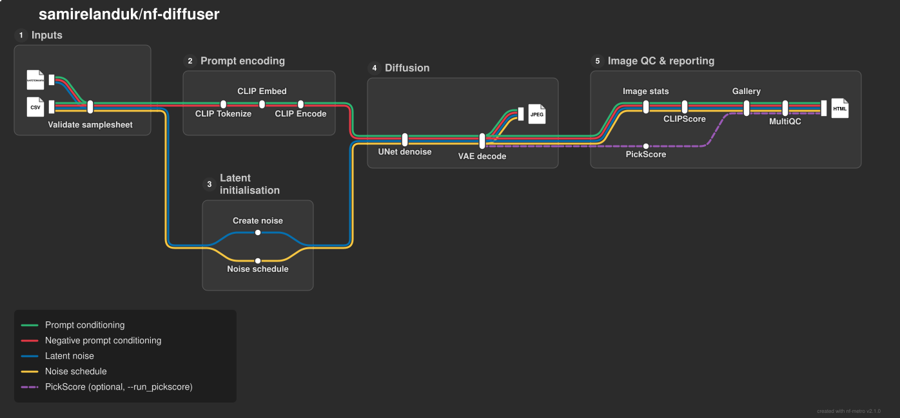

# samirelanduk/nf-diffuser

[](https://github.com/codespaces/new/samirelanduk/nf-diffuser)
[](https://github.com/samirelanduk/nf-diffuser/actions/workflows/nf-test.yml)
[](https://github.com/samirelanduk/nf-diffuser/actions/workflows/linting.yml)[](https://doi.org/10.5281/zenodo.XXXXXXX)
[](https://www.nf-test.com)

[](https://www.nextflow.io/)
[](https://github.com/nf-core/tools/releases/tag/4.0.2)
[](https://docs.conda.io/en/latest/)
[](https://www.docker.com/)
[](https://sylabs.io/docs/)
[](https://cloud.seqera.io/launch?pipeline=https://github.com/samirelanduk/nf-diffuser)

## Introduction

**samirelanduk/nf-diffuser** is a generative AI pipeline that creates images from text prompts using latent diffusion. It takes a samplesheet of text prompts, with optional negative prompts, plus a Stable Diffusion 1.5 `.safetensors` checkpoint (either your own, or one of several popular models downloaded from Hugging Face by name), and produces one JPEG per prompt along with the intermediate latents and conditioning tensors.



> In case the image above is not loading, please have a look at the [static version](docs/images/nf-diffuser_metro_map_light.png).

1. Create a random starting latent at the requested size ([`pydiffuse noise create`](https://github.com/samirelanduk/pydiffuse))
2. Build the noise schedule ([`pydiffuse noise schedule`](https://github.com/samirelanduk/pydiffuse))
3. Encode the prompt and negative prompt with CLIP: tokenize, embed and encode ([`pydiffuse clip`](https://github.com/samirelanduk/pydiffuse))
4. Denoise the latent with the UNet using classifier-free guidance ([`pydiffuse sample denoise`](https://github.com/samirelanduk/pydiffuse))
5. Decode the denoised latent into an image with the VAE ([`pydiffuse vae decode`](https://github.com/samirelanduk/pydiffuse))
6. Assess each image's quality and prompt adherence: basic image statistics, [CLIPScore](https://doi.org/10.18653/v1/2021.emnlp-main.595), and optionally [PickScore](https://huggingface.co/yuvalkirstain/PickScore_v1)
7. Present QC metrics, a thumbnail gallery and software versions ([`MultiQC`](http://multiqc.info/))

## Usage

> [!NOTE]
> If you are new to Nextflow and nf-core, please refer to [this page](https://nf-co.re/docs/get_started/environment_setup/overview) on how to set-up Nextflow. Make sure to [test your setup](https://nf-co.re/docs/get_started/run-your-first-pipeline) with `-profile test` before running the workflow on actual data.

First, prepare a samplesheet with your prompts that looks as follows:

`samplesheet.csv`:

```csv
sample,prompt,negative_prompt,width,height,steps,cfg,sampler,schedule
TREE,"A photo of a tree","animals, people, text",768,512,30,5,heun,exponential
SKY,"A beautiful panorama of the sky",,,,,,,
```

Each row represents one image to generate. Only `sample` and `prompt` are required; the remaining columns can be left empty or omitted to use their defaults.

Now, you can run the pipeline using:

```bash
nextflow run samirelanduk/nf-diffuser \
   -profile <docker/singularity/conda> \
   --input samplesheet.csv \
   --outdir <OUTDIR>
```

Alternatively, to generate a single image with default settings, replace `--input samplesheet.csv` with `--prompt "A photo of a tree"`.

> [!WARNING]
> Please provide pipeline parameters via the CLI or Nextflow `-params-file` option. Custom config files including those provided by the `-c` Nextflow option can be used to provide any configuration _**except for parameters**_; see [docs](https://nf-co.re/docs/running/run-pipelines#using-parameter-files).

For more details and further functionality, please refer to the [usage documentation](docs/usage.md).

## Pipeline output

For more details about the output files and reports, please refer to the [output documentation](docs/output.md).

## Credits

samirelanduk/nf-diffuser was originally written by Sam M. Ireland.

## Contributions and Support

If you would like to contribute to this pipeline, please see the [contributing guidelines](docs/CONTRIBUTING.md).

## Citations

<!-- TODO nf-core: Add citation for pipeline after first release. Uncomment lines below and update Zenodo doi and badge at the top of this file. -->
<!-- If you use samirelanduk/nf-diffuser for your analysis, please cite it using the following doi: [10.5281/zenodo.XXXXXX](https://doi.org/10.5281/zenodo.XXXXXX) -->

An extensive list of references for the tools used by the pipeline can be found in the [`CITATIONS.md`](CITATIONS.md) file.

This pipeline uses code and infrastructure developed and maintained by the [nf-core](https://nf-co.re) community, reused here under the [MIT license](https://github.com/nf-core/tools/blob/main/LICENSE).

> **The nf-core framework for community-curated bioinformatics pipelines.**
>
> Philip Ewels, Alexander Peltzer, Sven Fillinger, Harshil Patel, Johannes Alneberg, Andreas Wilm, Maxime Ulysse Garcia, Paolo Di Tommaso & Sven Nahnsen.
>
> _Nat Biotechnol._ 2020 Feb 13. doi: [10.1038/s41587-020-0439-x](https://dx.doi.org/10.1038/s41587-020-0439-x).
